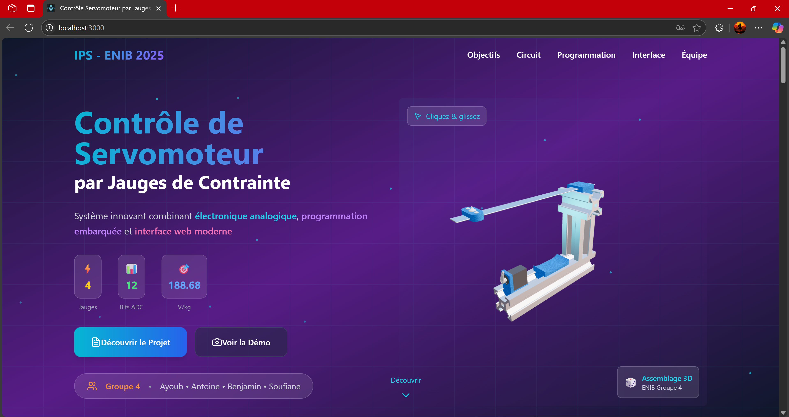

# 🎛️ Portfolio - Contrôle Servomoteur par Jauges de Contrainte  
**Projet IPS - ENIB 2025**

Portfolio web moderne présentant un système innovant de contrôle de servomoteur basé sur la déformation d'une lame mesurée par jauges de contrainte.

Interface **React** avec visualisation 3D **Three.js**, documentation technique interactive et présentation du projet IPS réalisé à l'**ENIB**.  
Inclut :  
- Modèle 3D interactif  
- Screenshots de l'interface IHM  
- Architecture système complète  

---

## 🌐 Accès Direct au Site

**Visitez le portfolio en ligne :** [https://ips-groupe-c-deformation-jauge.netlify.app/](https://ips-groupe-c-deformation-jauge.netlify.app/)

---
## 🚀 Installation Rapide

```bash
# Cloner et installer
git clone https://github.com/ayoub-machkour/Mesure-de-d-formation-par-jauges-Portfolio.git
cd Mesure-de-d-formation-par-jauges-Portfolio
npm install

# Lancer le site
npm start
```

Accédez à [http://localhost:3000](http://localhost:3000)

---

## ⚡ Technologies

- **React.js** – Framework frontend  
- **Three.js** – Visualisation 3D interactive  
- **Framer Motion** – Animations fluides  
- **Tailwind CSS** – Design moderne  

---

## 🎓 Auteur

Portfolio créé par **Ayoub Machkour**  

---

## 🖼️ Aperçu du Portfolio


